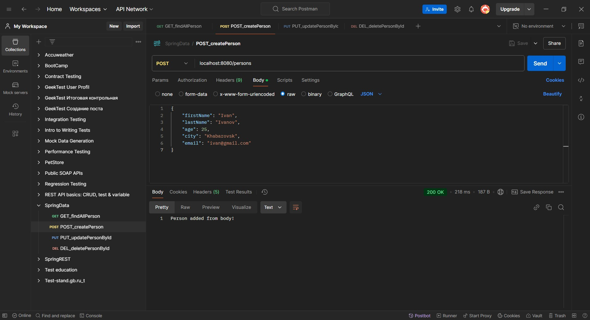
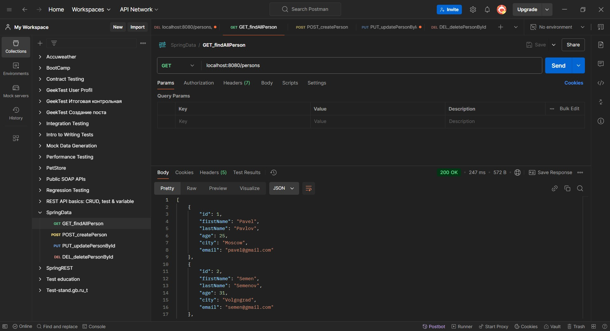
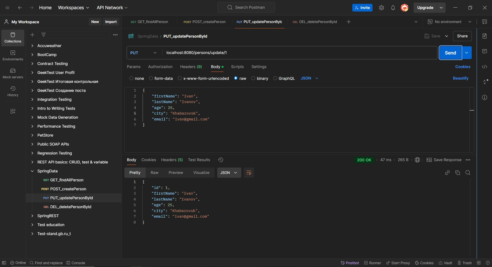
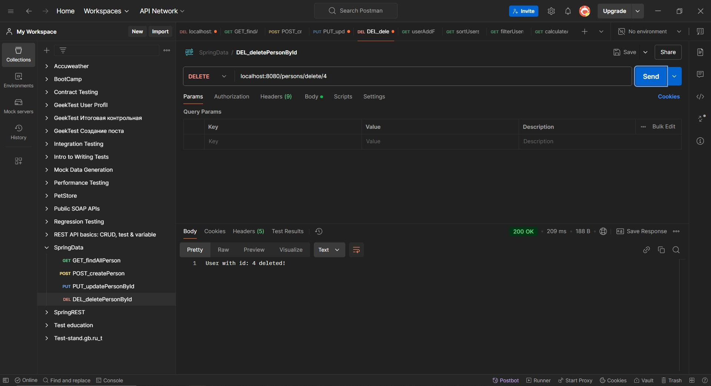

# Урок 5. Spring Data для работы с базами данных

Задание: 
Используйте Spring Data для создания репозитория, которое взаимодействует с базой данных. 
Создайте CRUD операции для класса Person.

======================================================================

## Демонстрация решения:

